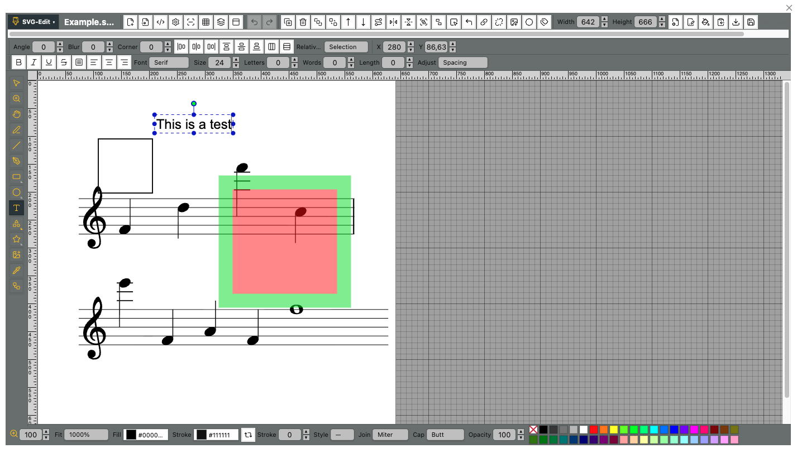

# SVG Editor for Obsidian

SVG Editor for Obsidian brings an SVG-edit based vector editor directly into your vault. It lets you create, open, edit, and save `.svg` files without leaving Obsidian.

## Features

- **Direct SVG editing**: Open `.svg` files from the file menu, the ribbon icon, commands, or the pencil button on the SVG.
- **Edit button**: Rendered SVGs show a small pencil button in the upper-right corner. Click it to open that SVG directly in the editor. This is enabled by default and can be disabled in the plugin settings.
- **Drawing tools**: Selection, rectangles, ellipses, lines, freehand paths, text, connectors, panning, zooming, and more.
- **Shape library**: Includes categories such as Basic, Arrows, Flowchart, Music, Mathematics, Animals, Objects, Symbols, and more.
- **Rulers and grid**: Use rulers, grid display, snapping, and multiple units including px, cm, mm, in, pt, and pc.
- **Layers and overview**: Manage layers, visibility, ordering, and use the overview panel for navigation.
- **Styling controls**: Edit fills, strokes, opacity, markers, gradients, line joins, line caps, and other SVG properties.
- **Source editing and export**: Edit SVG XML directly, use dynamic sizing, and export images from the editor.
- **Draft safety**: Changes are buffered as drafts before they are saved back to the vault file.

## Usage

1. **Create a new SVG**
   - Click the ribbon icon.
   - Or run `SVG Editor: Create new SVG` from the command palette.

2. **Edit an existing SVG**
   - Right-click an SVG file in the file explorer and choose `Edit with SVGEdit`.
   - Or focus an SVG file and click the ribbon icon.
   - Or hover over a rendered SVG in a note and click the pencil button in its upper-right corner.

3. **Use the editor**
   - Use the left toolbar for drawing and selection tools.
   - Use the top and bottom toolbars for object properties, fill/stroke settings, zoom, source editing, export, and document options.
   - Save to write the edited SVG back to the vault file.

## Settings

- **Show inline edit button**: Shows or hides the pencil button on rendered SVGs. Enabled by default.
- **Default document size**: Controls the width and height used when creating new SVG files.

## Technical Details

This plugin uses `SvgCanvas` from SVG-edit inside an Obsidian modal instead of embedding a separate iframe editor. The plugin integrates with Obsidian files (`TFile`), menus, commands, settings, and Markdown rendering so SVGs can be edited as normal vault files.

## Disclaimer

I vibecode my plugins—and the scope of this work exceeds my programming skills. Because of this, there is always a residual risk when using them. I do this primarily to bridge certain gaps in my own workflow. Should these plugins ever become obsolete because a professional developer used them as inspiration to code something truly solid and sophisticated, I would be absolutely thrilled.